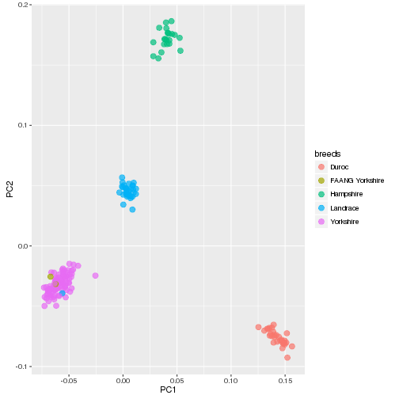

# Script: 2-PCA

- *Author: Scott Funkhouser*
- *Date: 20161019*
- *Project: [650K_Chip](../../../README.md)*
- *Sub Folder: [genotype_analysis](../../genotype_analysis.md)*

## Table of Contents

1. [Objectives](#objectives)
2. [Install libraries](#install-libraries)
3. [Load data](#load-data)
4. [Analysis](#analysis)
5. [Visualize](#visualize)


```r
setwd("/mnt/research/pigsnp/NSR/650K_Chip/genotype_analysis/scripts")
```

## Objectives

1. Using genotypes prepared in `1-data_prep.R`, visually inspect the variation
observed among genotyping data using eigenvector decomposition of the **G**
matrix (genetic relationship matrix, calculated among all 180 animals)

## Install libraries


```r
library(devtools)
library(magrittr)
library(ggplot2)
```

## Load data
Load intermediate data produced from `1-data_prep.R`. Data contains two objects:
a matrix of genotypes for all 180 animals, and a list containing animal IDs
organized by breed.


```r
load("../1-data_prep.RData")
```

## Analysis
Calculation of the **G** matrix will require a complete dataset with no
missing genotype calls. To account for this, I will fill missing genotypes
with the mean value for that SNP

Genotype call rates should already be high for each SNP


```r
call_rates <- apply(affy_geno, 2, function(x) {
                sum(!is.na(x)) / length(x)
              })
min(call_rates)
```

```
## [1] 0.9777778
```

There should already be no fixed SNPs


```r
fix_snps <- apply(affy_geno, 2, function(x) {
                length(unique(x)) == 1
            })
sum(fix_snps)
```

```
## [1] 0
```

Fill in missing genotype calls with the mean for that SNP


```r
X <- apply(affy_geno, 2, function(x) {
            x[is.na(x)] <- mean(x, na.rm = TRUE)
            return(x)
     })
```

Compute **G**


```r
X <- scale(X, center = TRUE, scale = TRUE)
G <- X %*% t(X) / ncol(X)
```

Eigendecomposition of **G**


```r
evd <- eigen(G)
pcs <- as.data.frame(evd$vectors)
colnames(pcs) <- paste0(rep("PC", ncol(pcs)), seq(1:ncol(pcs)))
```

Using `array_ids`, provide breed information for each row of `pcs` (or each
row of `affy_geno`)


```r
breeds <- c()
# For each rowname in affy_geno
for (i in rownames(affy_geno)) {
    # For each breed in array_ids
    for (j in 1:length(array_ids)) {
        # Does the ith rowname match one of the IDs for the jth breed?
        if (i %in% paste0(array_ids[[j]], ".CEL"))
            breeds[i] <- names(array_ids)[j]
    }
}
# Remove names, which are automatically generated from the for loop
breeds <- unname(breeds)
```

Label the last 8 animals without breed information in `array_ids` with
"FAANG Yorkshire" and "Yorkshire" to distinguish animals from FAANG project
from which we have WGS data.


```r
breeds <- c(breeds, rep("FAANG Yorkshire", 2), rep("Yorkshire", 6))
pcs <- cbind(breeds, pcs)
```

## Visualize


```r
ggplot(pcs, aes(x = PC1, y = PC2, color = breeds)) +
    geom_point(size = 3, alpha = 0.7)
```



One of the Landrace samples clusters with the Yorkshire. Which animal is this?


```r
rownames(affy_geno)[pcs$PC1 < 0 & pcs$PC2 < 0 & pcs$breeds == "Landrace"]
```

```
## [1] "a550588-4269754-110716-107_F06.CEL"
```

