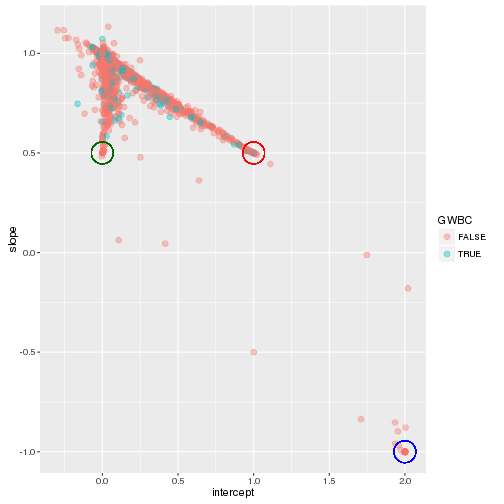

# Script: 3-compare_calls

- *Author: Scott Funkhouser*
- *Date: 20161025*
- *Project: [650K_Chip](../../../README.md)*
- *Sub Folder: [genotype_analysis](../../genotype_analysis.md)*

## Table of Contents

1. [Objectives](#objectives)
2. [Install libraries](#install-libraries)
3. [Load data](#load-data)
4. [Analysis](#analysis)
  - [Filter data](#filter-data)
  - [Regression](#regression)
  - [Allele frequencies](#allele-frequencies)


```r
setwd("/mnt/research/pigsnp/NSR/650K_Chip/genotype_analysis/scripts")
```

## Objectives

1. From Yorkshire animals genotyped with the 650K chip, isolate those that
were previously genotyped on the Illumina 60K beadchip. Previous 60K data
may be loaded from the `SF_PG_Industry` project
2. For each SNP genotyped on both Illumina 60K and Affymetrix 650K platforms,
test genotype call consistancy using a linear regression.

## Install libraries


```r
library(devtools)
library(magrittr)
library(ggplot2)
```

Install [snpTools](https://github.com/funkhou9/snpTools/commit/6603afd1db77fb6a93ece38b4a3eeafc7fbc92f2)


```r
# install_github("funkhou9/snpTools")
library(snpTools)
```

Install [breedTools](https://github.com/funkhou9/breedTools/commit/00b77d774e31b69f885b3ccbe413f7caf92abbbb)


```r
# install_git("/mnt/research/pigsnp/raw_data/SF_working_dir/breed_compos/breedTools")
library(breedTools)
```

## Load data
Load prepped Affymetrix genotyping data from `1-data_prep`


```r
load("../1-data_prep.RData")
```

Load Yorkshire sire genotypes from `SF_PG_Industry`. About 90 animals from
this set of ~900 should have also been used for Affymetrix 650K genotyping.


```r
load(paste0("/mnt/research/pigsnp/raw_data/SF_working_dir",
            "/Yorkshire_dataset_cleaning/yorkshireDataForModel.RData"))
```

Load previous work from this project that assembled all physical positions
for Affy and Illumina chips


```r
load("/mnt/research/pigsnp/NSR/650K_Chip/snp_inspection/pos_list.RData")
```

Load Sample table from Yorkshire genotyped on plate1 of the
Affymetrix assay. The "Sample Name" in this dataset will correspond to
registration numbers


```r
plate1_samples <-
   read.csv(paste0("/mnt/research/pigsnp/raw_data/affymetrix_hd/PigIA&MIAX-selected/",
                   "PigIA&MIAX_Sample_Table.csv"),
            header = TRUE,
            stringsAsFactors = FALSE)
```

Load Sample table from plate2. Those six of eight Yorkshire on plate2 will
have registration numbers in the "MSU.ID.." column.


```r
plate2_samples <-
    read.csv(paste0("/mnt/research/pigsnp/raw_data/affymetrix_hd/PigIA&MIAX_pt2/",
                    "PigIA&MIAX_Sample_Table.csv"),
             header = TRUE,
             stringsAsFactors = FALSE)
```

Load reference panel of allele frequencies required to compute
GWBC.


```r
data("GWBC_ref_B")
```

## Analysis
### Filter data
Obtain registration numbers and "affy array IDs" for all Yorkshire animals genotyped
on the Affy platforms.


```r
hd_yorks_reg <- c(plate1_samples$Sample.Name, plate2_samples$MSU.ID..[91:96])
hd_yorks_id <- c(plate1_samples$Best.Array, plate2_samples$Best.Array[91:96])
```

Not all numbers in `hd_yorks_reg` are necessarily in `yorkshireGenoDose`. Find which
`hd_yorks_reg` and corresponding `hd_yorks_id` are present in `yorkshireGenoDose`.


```r
idx <- hd_yorks_reg %in% rownames(yorkshireGenoDose)
```

Subset both illumina and affy datasets with animals present in both


```r
geno_60K <- yorkshireGenoDose[hd_yorks_reg[idx], ]
geno_650K <- affy_geno[paste0(hd_yorks_id[idx], ".CEL"), ]
```

Find physical positions that match between Affy and Illumina
platforms. Note that there are duplicated positions in the Illumina
map (mostly '0:0' positions and some non-'0:0' positions) that
have differing marker names. We'll exclude these physical positions.


```r
comm_pos <- intersect(pos_list$Affy650, pos_list$SNP60[!duplicated(pos_list$SNP60)])
```

Find which markers (from each platform) correspond to each common
physical position


```r
illum_markers <- marker_list$SNP60[match(comm_pos, pos_list$SNP60)]
affy_markers <- marker_list$Affy650[match(comm_pos, pos_list$Affy650)]
```

Identify markers that are present in both genotyping datasets


```r
idx <- illum_markers %in% colnames(yorkshireGenoDose) &
        affy_markers %in% colnames(affy_geno)
```

Subset SNPs according to common markers present in both datasets.


```r
illum_calls <- geno_60K[, illum_markers[idx]]
affy_calls <- geno_650K[, affy_markers[idx]]
```

Identify markers with at least a 90% call rate in both datasets


```r
idx2 <- apply(illum_calls, 2,
              function(x) {
                  sum(!is.na(x)) / length(x) >= 0.9
              })
idx3 <- apply(affy_calls, 2,
              function(x) {
                  sum(!is.na(x)) / length(x) >= 0.9
              })
```

Identify markers that are unfixed in both datasets (For a single SNP, at
two animals must have differing conclusive genotype calls)


```r
idx4 <- apply(illum_calls, 2,
              function(x) {
                  length(unique(x[!is.na(x)])) > 1
              })
idx5 <- apply(affy_calls, 2,
              function(x) {
                  length(unique(x[!is.na(x)])) > 1
              })
```

Keep only SNPs that have sufficient call rate in both datasets and
that are unfixed in both datasets.


```r
illum_calls <- illum_calls[, idx2 & idx3 & idx4 & idx5]
affy_calls <- affy_calls[, idx2 & idx3 & idx4 & idx5]
```

### Regression
Apply regression for the ith column of each datasets. When using
`mapply()`, the `...` passed must be data.frames if `mapply()` is
to iterate over columns.


```r
fits <- mapply(function(y, x) lm(y ~ x),
               as.data.frame(illum_calls),
               as.data.frame(affy_calls))
```

Tabulate marker name, "x coefficient", and standard error.
Warnings of "essentially perfect fits". Ignore these to avoid
thousands of lines of output.


```r
suppressWarnings({int_slope_r2 <- lapply(fits,
                     function(x) {
                         c("intercept" = summary(x)$coefficients[1, 1],
                           "slope" = summary(x)$coefficients[2, 1],
                           "R2" = summary(x)$r.squared)
                     })})
results <- as.data.frame(do.call(rbind, int_slope_r2))
```

How many SNPs out of 30,941 in `results` have a slope of exactly 1 and R2 of
exactly 1?


```r
nrow(results[results$slope == 1 & results$R2 == 1, ])
```

```
## [1] 2080
```

Add 4th column, a logical vector that is `TRUE` if the SNP is currently used
in GWBC calculation.


```r
results <- cbind(results, "GWBC" = rownames(results) %in% rownames(GWBC_ref_B))
```

Plot joint distribution of coefficient estimates (slopes) and R squared values across
all models. Highlight interesting points that deserve further investigation.


```r
ggplot(results, aes(x = R2, y = slope, color = GWBC)) +
    geom_point(size = 2.5, alpha = 0.4) +
    geom_point(aes(x = 1, y = 0.5), size = 10, shape = 1, color = "red") +
    geom_point(aes(x = 1, y = -1), size = 10, shape = 1, color = "darkgreen") +
    geom_point(aes(x = 0, y = 0), size = 10, shape = 1, color = "blue")
```


The data suggests that for those SNPs used to compute GWBC, no transformation
of Affy coding to Illumina coding is needed.
Any models where the estimated slope is above 0.5 may indicate that
both Affy and Illumina platforms are counting the same allele, but genotyping
errors (or the possibility that the platforms are counting slightly different
loci) may prevent the estimated coefficients to be 1.0.
From each of the **red**, **blue**, and **green** points highlighted in the
above plot, provide a contingency table of genotype calls.

For the **red** points (points with roughly 0.5 slope and near perfect R2):


```r
head(results[round(results$R2, 1) == 1 & round(results$slope, 1) == 0.5, ])
```

```
##                 intercept     slope        R2  GWBC
## ALGA0002747  1.000000e+00 0.5000000 1.0000000 FALSE
## ALGA0004678  9.855879e-01 0.5044219 0.9808203 FALSE
## H3GA0002791  3.947957e-16 0.5000000 1.0000000 FALSE
## MARC0082076 -3.242965e-16 0.5000000 1.0000000 FALSE
## MARC0073315  1.000000e+00 0.5000000 1.0000000 FALSE
## ALGA0006547  9.680851e-01 0.5106383 0.9612015  TRUE
```

Examples of genotypes for this set of markers:


```r
table(fits$ALGA0002747$model)
```

```
##    x
## y    0  2
##   1  3  0
##   2  0 59
```

```r
table(fits$ALGA0004678$model)
```

```
##    x
## y    0  1  2
##   1 17  1  0
##   2  0  0 44
```

```r
table(fits$H3GA0002791$model)
```

```
##    x
## y    0  2
##   0 41  0
##   1  0 21
```

```r
table(fits$ASGA0065768$model)
```

```
##    x
## y    0  1  2
##   1 23  0  0
##   2  0  1 38
```

For the **blue** points (points that have near-zero R2 values)


```r
head(results[results$R2 < 0.05, ])
```

```
##             intercept       slope           R2  GWBC
## ASGA0096844 0.1080617  0.06232133 0.0121087782 FALSE
## ALGA0028021 1.7493809 -0.01188707 0.0004052411 FALSE
## DRGA0008687 0.4154786  0.04480652 0.0032858113 FALSE
## ALGA0081437 0.6379310  0.36206897 0.0071093486 FALSE
```

Examples of genotypes for this set of markers:


```r
table(fits$ASGA0096844$model)
```

```
##    x
## y    0  1  2
##   0 11 25 15
##   1  0  8  3
```

```r
table(fits$ALGA0028021$model)
```

```
##    x
## y    0  1  2
##   1  5  0 11
##   2  5 19 20
```

```r
table(fits$DRGA0008687$model)
```

```
##    x
## y    0  1  2
##   0 15 15  6
##   1  7 12  5
##   2  1  1  0
```

```r
table(fits$ALGA0081437$model)
```

```
##    x
## y    1  2
##   0  1 10
##   1  0 17
##   2  1 31
```

For the **green** points (points that have near -1 slope)


```r
head(results[results$slope < -0.75, ])
```

```
##             intercept slope R2  GWBC
## DRGA0000277         2    -1  1 FALSE
## M1GA0000883         2    -1  1 FALSE
## ASGA0003027         2    -1  1 FALSE
## ASGA0003043         2    -1  1 FALSE
## ALGA0003901         2    -1  1 FALSE
## DRGA0001119         2    -1  1 FALSE
```

Examples of genotypes for this set of markers:


```r
table(fits$DRGA0000277$model)
```

```
##    x
## y    0  1  2
##   0  0  0 50
##   1  0  9  0
##   2  1  0  0
```

```r
table(fits$M1GA0026765$model)
```

```
##    x
## y    0  1  2
##   0  0  1 22
##   1  0 27  1
##   2 10  0  0
```

```r
table(fits$CASI0000302$model)
```

```
##    x
## y    0  1  2
##   0  0  0  1
##   1  0  3  0
##   2 56  1  0
```

```r
table(fits$M1GA0025413$model)
```

```
##    x
## y    0  1  2
##   0  0  0 12
##   1  2 20  0
##   2 26  0  0
```

Plot joint distribution of slopes and intercepts fitted across all models.
Highlight interesting points that deserve further investigation.


```r
ggplot(results, aes(x = intercept, y = slope, color = GWBC)) +
    geom_point(size = 2.5, alpha = 0.4) +
    geom_point(aes(x = 1, y = 0.5), size = 10, shape = 1, color = "red") +
    geom_point(aes(x = 0, y = 0.5), size = 10, shape = 1, color = "darkgreen") +
    geom_point(aes(x = 2, y = -1), size = 10, shape = 1, color = "blue")
```



From each of the **red**, **blue**, and **green** points highlighted in the
above plot, provide a contingency table of genotype calls.

For the **red** points(slope near 0.5 and intercept near 1.0):


```r
head(results[round(results$intercept, 1) == 1 & round(results$slope, 1) == 0.5, ])
```

```
##             intercept     slope        R2  GWBC
## ALGA0002747 1.0000000 0.5000000 1.0000000 FALSE
## ALGA0004678 0.9855879 0.5044219 0.9808203 FALSE
## MARC0073315 1.0000000 0.5000000 1.0000000 FALSE
## ALGA0006547 0.9680851 0.5106383 0.9612015  TRUE
## ALGA0007262 1.0000000 0.5000000 1.0000000 FALSE
## MARC0033050 1.0221141 0.4913755 0.9731162 FALSE
```

Examples of genotypes for this set of markers:


```r
table(fits$ALGA0002747$model)
```

```
##    x
## y    0  2
##   1  3  0
##   2  0 59
```

```r
table(fits$ALGA0004678$model)
```

```
##    x
## y    0  1  2
##   1 17  1  0
##   2  0  0 44
```

```r
table(fits$MARC0073315$model)
```

```
##    x
## y    0  2
##   1  1  0
##   2  0 61
```

```r
table(fits$ASGA0006216$model)
```

```
##    x
## y    0  2
##   1 14  0
##   2  0 48
```

For the **green** points(slope near 0.5 and intercept near 0.0):


```r
head(results[round(results$intercept, 1) == 0 & round(results$slope, 1) == 0.5, ])
```

```
##                 intercept     slope        R2  GWBC
## ASGA0003370  1.639344e-02 0.5491803 0.8585519 FALSE
## H3GA0002791  3.947957e-16 0.5000000 1.0000000 FALSE
## MARC0082076 -3.242965e-16 0.5000000 1.0000000 FALSE
## H3GA0005011  5.198663e-03 0.5061270 0.9785122 FALSE
## ASGA0008132  4.640371e-03 0.5127610 0.9685486 FALSE
## ASGA0105436  6.767926e-16 0.5000000 1.0000000 FALSE
```

Examples of genotypes for this set of markers:


```r
table(fits$ASGA0003370$model)
```

```
##    x
## y    0  1  2
##   0 49  1  0
##   1  0  5  7
```

```r
table(fits$H3GA0002791$model)
```

```
##    x
## y    0  2
##   0 41  0
##   1  0 21
```

```r
table(fits$MARC0082076$model)
```

```
##    x
## y    0  2
##   0 55  0
##   1  0  7
```

```r
table(fits$H3GA0005011$model)
```

```
##    x
## y    0  1  2
##   0 47  0  0
##   1  0  1 14
```

For the **blue** points(slope near 0.5 and intercept near 0.0):


```r
head(results[round(results$intercept, 1) == 2 & round(results$slope, 1) == -1, ])
```

```
##             intercept slope R2  GWBC
## DRGA0000277         2    -1  1 FALSE
## M1GA0000883         2    -1  1 FALSE
## ASGA0003027         2    -1  1 FALSE
## ASGA0003043         2    -1  1 FALSE
## ALGA0003901         2    -1  1 FALSE
## DRGA0001119         2    -1  1 FALSE
```

Examples of genotypes for this set of markers:


```r
table(fits$DRGA0000277$model)
```

```
##    x
## y    0  1  2
##   0  0  0 50
##   1  0  9  0
##   2  1  0  0
```

```r
table(fits$M1GA0000883$model)
```

```
##    x
## y    0  1  2
##   0  0  0 41
##   1  0 18  0
##   2  3  0  0
```

```r
table(fits$ASGA0003027$model)
```

```
##    x
## y    0  1  2
##   0  0  0 16
##   1  0 30  0
##   2 16  0  0
```

```r
table(fits$ASGA0003043$model)
```

```
##    x
## y    0  1  2
##   0  0  0 16
##   1  0 29  0
##   2 17  0  0
```

### Allele frequencies
Plot differences in allele frequencies for all SNPs.

Allele frequency calculation exists in the `breedTools` package. It requires
*currently* supplying a list as the second argument, `populations`, which
will specify the IDs in a particular population that you wish to calculate
allele frequencies with. For the purposes of estimating allele frequencies
from all individuals in a matrix, this function is a little cumbersome.


```r
illum_freq <-
    breedTools::allele_freq(geno = illum_calls,
                            populations = list("Illumina" = rownames(illum_calls)))
affy_freq <-
    breedTools::allele_freq(geno = affy_calls,
                            populations = list("Affy" = rownames(affy_calls)))
allele_frequencies <- as.data.frame(cbind(illum_freq, affy_freq))
```

```r
ggplot(allele_frequencies, aes(x = Illumina, y = Affy)) +
    geom_point() +
    labs(x = "Illumina allele frequencies",
         y = "Affymetrix allele frequencies")
```


